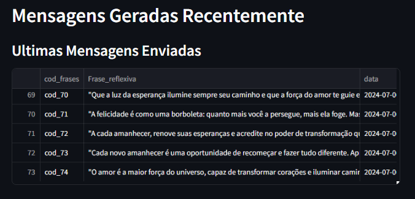
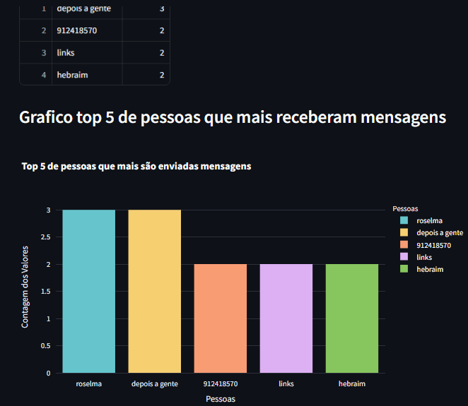

# Projeto: Gerador de Frases Reflexivas com Streamlit e ChatGPT

## Descrição

O projeto consiste em uma página web interativa construída com o Streamlit e alimentada pela inteligência artificial do ChatGPT. O objetivo é gerar frases reflexivas quando o usuário pressionar um botão específico. Além disso, o aplicativo oferece a opção de enviar essas frases para um contato no WhatsApp. As frases geradas são salvas em um arquivo CSV usando a biblioteca pandas. No final da página, há uma tabela e um gráfico que mostram as pessoas que mais receberam frases.

## Funcionalidades Principais

Siga o link para veres o guia que usei para esse projecto   [Guia do Projecto](".\datasets\plano de projecto.txt")

1. **Gerador de Frases Reflexivas:**
   - O usuário pode clicar em um botão para gerar uma frase reflexiva aleatória.
   - A frase é criada pela inteligência artificial do ChatGPT.

   

2. **Envio para WhatsApp:**
   - O usuário pode escolher enviar a frase gerada para um contato no WhatsApp.
   - O aplicativo verifica se o WhatsApp está instalado no computador do usuário antes de enviar a mensagem.

3. **Armazenamento em Arquivo CSV:**
   - Todas as frases geradas são salvas em um arquivo CSV.
   - O arquivo contém informações sobre a frase e o destinatário.
   

4. **Estatísticas de Recebimento:**
   - No final da página, há uma tabela e um gráfico que mostram as pessoas que mais receberam frases.
   - Isso permite que o usuário veja quais contatos estão mais envolvidos com o aplicativo.
   

## Dificuldades

Achei um pouco trabalhar com o Strealit, as funcionalidades não casam, mas é perfeito para uma protipagem rápida, e simples, assim como está.

Tive que lidar com muitos erros especialmente em poder enviar os dados no dataframe, e enviar a mensagem no Whatsapp, exibia sempre mensagens de erro que uma variavel acima declarada, não estava declarada, usei as alternativas que consegui pensar no momento. Em um futuro proximo, irei certamente atualizar o código, e certamente, mudar para uma abordagem orientado a objecto, que creio iria eliminar os erros que encontrei ao fazer esse projecto.
